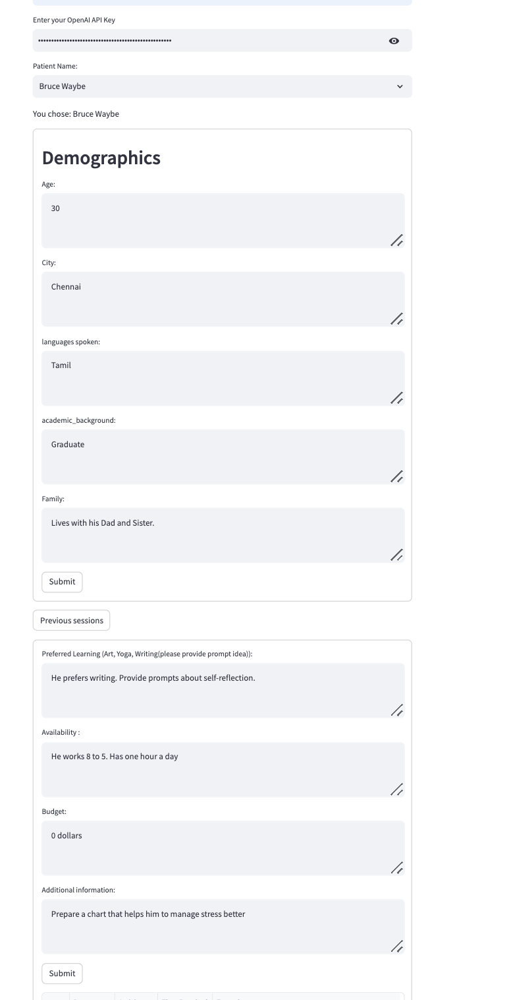
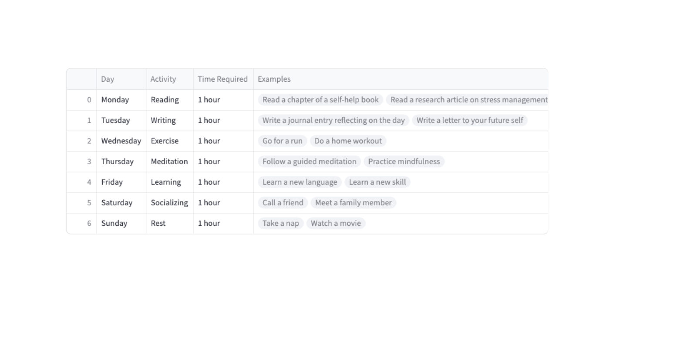

# Anxiety Management Platform using AI

 Our project focuses on developing a personalized AI-driven platform for anxiety management. I forked starter code from an earlier repo (https://github.com/mafda/ml_with_fastapi_and_streamlit)

## Table of Contents

- [Overview of the Project](#overview-of-the-project)
- [Why Streamlit?](#why-use-streamlit)
- [System Architecture](#architecture)
- [Setting Up the Project](#project-setup)
- [Outcome & Screenshots](#results)
- [Final Thoughts](#conclusions)
- [Tools Used](#tools)

## Overview of the Project

The main goal of this platform is to provide a tailored approach to anxiety management by leveraging the power of AI. Using Streamlit for interface design, OpenAI and SQLite for backend services, we aim to provide therapists and patients a tool that is both engaging and effective.

## Why Streamlit?

[Streamlit](https://streamlit.io) is a user-friendly Python framework, allowing for the creation of interactive dashboards and web apps without requiring extensive web development experience. Given its compatibility with various ML and visualization libraries, it's an ideal choice for this project.


### Architecture


### Setting Up the Project

- Start by cloning this repository:

```shell
(base)$: git clone https://github.com/Sahanave/wwcode_hackathon2023_anxiety_management_tool.git
(base)$: cd wwcode_hackathon2023_anxiety_management_tool
(base)$: conda create -n ai-tool-testing python=3.8
(base)$:conda activate ai-tool-testing
(ai-tool-testing)$: pip install -r requirements.txt
(ai-tool-testing)$: streamlit run app.py

```
- Access the interface at [http://localhost:8501](http://localhost:8501)

## Outcome & Screenshots






